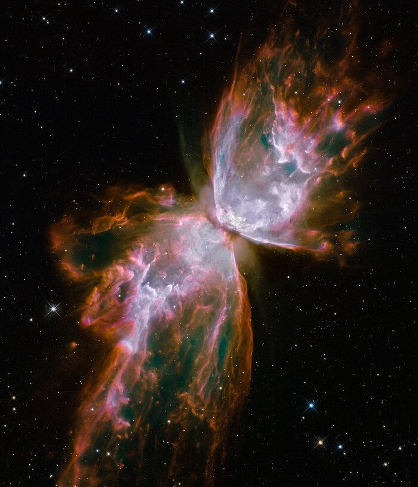

NGC 6302

While it may resemble a delicate celestial butterfly, NGC 6302, commonly known as the Bug or Butterfly Nebula, is anything but serene. Its seemingly fragile "wings" are in reality churning cauldrons of gas, superheated to nearly 20,000 degrees Celsius and expanding through space at an incredible speed exceeding 950,000 kilometers per hour – fast enough to cover the Earth-to-Moon distance in just 24 minutes. At the heart of this furious spectacle lies a dying star, once five times the mass of our Sun, which has shed its outer layers and now bombards the expelled material with ultraviolet radiation, causing it to brilliantly glow. This celestial marvel is a prime example of a planetary nebula, a term historically applied due to their often spherical appearance through smaller telescopes.

The Wide Field Camera 3 (WFC3), a new instrument installed on the NASA/ESA Hubble Space Telescope in May 2009, during a crucial servicing mission, captured this stunning <a href="https://esahubble.org/images/heic0910h/">image</a> of NGC 6302. Located roughly 3800 light-years away within our Milky Way's Scorpius constellation, the nebula's glowing gas comprises the star's outer layers, ejected over approximately 2200 years. The "butterfly" itself stretches for more than two light-years, about half the distance to our nearest star, Proxima Centauri.

The central star remains hidden, enveloped by a doughnut-shaped ring of dust that appears as a dark band constricting the nebula's center. This dense dust belt funnels the star's outflow, creating the distinctive "bipolar" or hourglass shape seen in many planetary nebulae. Though the gas itself is an unusually hot 20,000 degrees Celsius, the hidden central star boasts an astonishing surface temperature of over 220,000 degrees Celsius, making it among the hottest stars known in our galaxy.

The WFC3 image unveils the star's complex history of ejections. Initially a colossal red giant (about 1000 times our Sun's diameter), it slowly shed its outer layers. Some gas left its equator at a relatively low speed (perhaps 32,000 km/h), forming the central dust ring. Subsequent, higher-speed ejections perpendicular to this ring created the elongated "wings." As the central star further heated, a much faster stellar wind, traveling over 3.2 million km/h, then sculpted and refined the existing wing-shaped structure. The image also reveals numerous finger-like projections, indicating denser pockets of outflow that have resisted the stellar wind's powerful pressure.

The nebula's vibrant colors offer insights into its composition and dynamics. Reddish outer edges are primarily due to nitrogen emission, marking the coolest visible gas. WFC3's diverse filters, designed to isolate light from various chemical elements, allow astronomers to determine the gas's temperature, density, and composition. White-colored regions, rich in sulfur, highlight areas where fast-moving gas collides with slower, previously ejected material, generating powerful shock waves—visible as bright, crisp edges facing the central star, exemplified by the distinct white blob at the upper right. These Hubble observations of NGC 6302, captured on July 27, 2009, in ultraviolet and visible light using specific filters for oxygen, helium, hydrogen, nitrogen, and sulfur, were part of the Hubble Servicing Mission 4 Early Release Observations.

