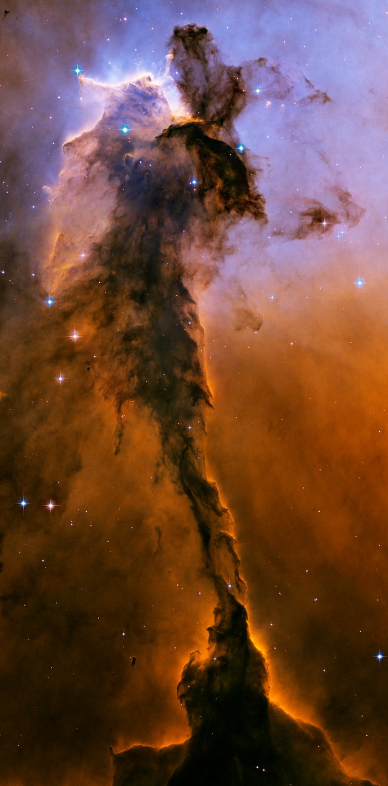

Eagle Nebula

Resembling a majestic, winged <a href="https://esahubble.org/images/heic0506b/">figure</a>, this cosmic structure is, in fact, a towering column of frigid gas and dust emerging from the heart of the Eagle Nebula, a stellar nursery. This impressive pillar stretches 9.5 light-years high, equivalent to approximately 90 trillion kilometers, or roughly twice the distance between our Sun and its nearest stellar neighbor.

Within the chaotic environment of the Eagle Nebula, where the intense energy from young stars sculpts fantastical landscapes, stars are born from cold hydrogen gas clouds. This towering structure may serve as a massive incubator for these nascent stars. However, a powerful torrent of ultraviolet light emanating from a cluster of hot, massive young stars (located beyond the image's top edge) is actively eroding the pillar, simultaneously illuminating its rugged surface. Wispy streamers of gas are seen "boiling off" this surface, contributing to the hazy appearance around the structure and emphasizing its three-dimensional form, all silhouetted against the softer glow of more distant gas.

The dark hydrogen cloud at the very top of the tower exhibits remarkable resistance to this erosion, much like dense brush resisting a prairie fire. The intense ultraviolet light, like fire, rapidly consumes the less dense surrounding gas but slows its destructive path when encountering these thick pockets of hydrogen gas and dust, allowing them to endure longer. It's within these resilient gaseous confines that new stars are believed to be forming, some perhaps from the gravitational collapse of dense gas, while others may be spurred into existence by pressure from gas heated by the nearby luminous stars.

Indeed, the first generation of stars might have begun forming even before the massive star cluster unleashed its scorching light. These early stellar births likely occurred as denser regions of cold gas within the tower succumbed to their own gravity. The visible bumps and finger-like protrusions in the tower's center are prime examples of these stellar birthing grounds. Though seemingly small, these areas are roughly the size of our own solar system. These fledgling stars' growth was abruptly halted when the intense light from the star cluster dissipated their protective gaseous cradles, cutting off their essential gas supply.

Ironically, the same intense starlight from the young cluster may also be catalyzing star formation in other parts of the tower. This phenomenon is evident in the large, glowing clumps and finger-shaped outgrowths at the structure's apex. The starlight is thought to heat the gas at the tower's top, creating a shock front – visible as a bright rim along the nebula's upper-left edge. As this heated gas expands, it acts like a powerful ram, compressing the cooler, darker gas ahead of it. This intense pressure facilitates the conditions necessary for new stars to form, a process that may continue as the shock front gradually advances down the tower. The striking colors in the image result from gas energized by the cluster's potent ultraviolet light, with the blue hues at the top indicating glowing oxygen and the red in the lower region originating from glowing hydrogen. This particular image of the Eagle Nebula was captured in November 2004 using the Advanced Camera for Surveys aboard the NASA/ESA Hubble Space Telescope.