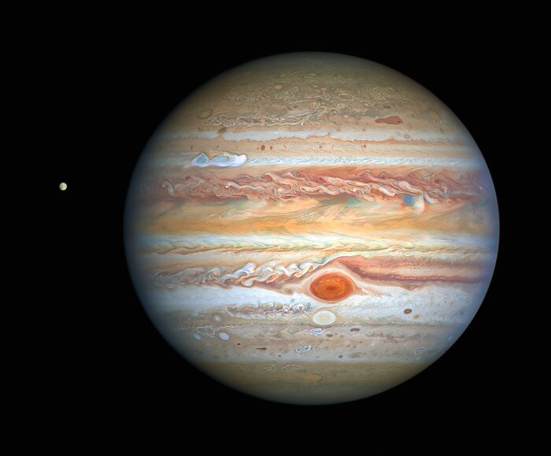

Jupiter - A Glimpse into the Giant's Turbulent Heart

Jupiter, the largest planet in our solar system, is a true behemoth, dwarfing all other planets combined. Classified as a gas giant, it's primarily composed of hydrogen and helium, lacking a solid surface like Earth. Its colossal size and rapid rotation create powerful atmospheric phenomena, most notably the iconic Great Red Spot—a persistent, colossal storm larger than Earth that has raged for centuries. The planet's colorful, swirling bands are testament to its turbulent weather systems, driven by immense internal heat and powerful jet streams that define its majestic and ever-changing appearance.

Beyond its striking visual characteristics, Jupiter plays a crucial role in shaping our solar system. Its immense gravitational pull acts as a cosmic vacuum cleaner, deflecting or capturing many comets and asteroids that might otherwise pose a threat to the inner planets, including Earth. This protective influence is a key factor in the stability of our planetary neighborhood. Furthermore, Jupiter possesses a vast and diverse system of moons, with over 90 confirmed. Among these, the four largest — Io, Europa, Ganymede, and Callisto (known as the Galilean moons) — are worlds unto themselves, each presenting unique scientific curiosities, from Io's intense volcanic activity to Europa's tantalizing subsurface ocean.

Studying Jupiter provides invaluable insights into planetary formation and the dynamics of gas giants, both within and beyond our solar system. Missions like NASA's Juno spacecraft have been instrumental in probing its deep atmosphere, magnetic field, and internal structure, revealing complexities that challenge existing models. The ongoing exploration of Jupiter and its moons continues to push the boundaries of our understanding of planetary science, offering tantalizing clues about the potential for life in extreme environments and the fundamental processes that govern the evolution of planetary systems across the cosmos.

The NASA/ESA Hubble Space Telescope's recent <a href="https://esahubble.org/images/heic2017a/">image</a>
 of Jupiter, taken on August 25, 2020, from a distance of 653 million kilometers, is providing researchers with fresh insights into the monster planet's dynamic weather. Noteworthy features in this sharp view include a remarkable new storm, another instance of the Great Red Spot's "cousin" changing color, and a clear depiction of Jupiter's icy moon Europa.

