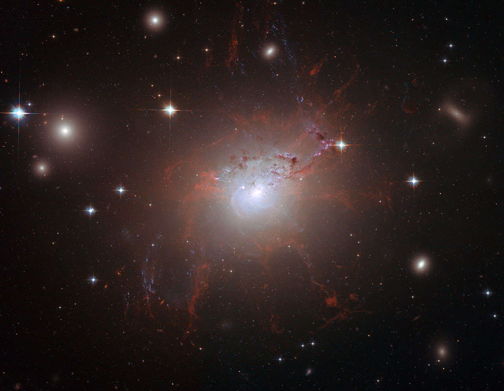

NGC 1275

In July and August 2006, the NASA/ESA Hubble Space Telescope's Advanced Camera for Surveys captured a truly stunning <a href="https://esahubble.org/images/heic0817a/">image</a> of NGC 1275. This detailed view provided an unprecedented look at the galaxy's fragile, reddish filamentary structures, which appear as a lacy network around the bright central galaxy. Remarkably, these filaments remain cool despite being enveloped by gas that is a scorching 55 million degrees Celsius. Their structure is maintained by an encompassing magnetic field, which also demonstrates the transfer of energy from the central black hole to the surrounding gas. 

Based on these filamentary observations, astronomers were, for the very first time, able to estimate the magnetic field's strength. This allowed them to show how these extragalactic fields have preserved the filaments' integrity for 100 million years against the dual threats of gravitational forces and the violent cluster environment. Hubble's sharp vision was so precise that astronomers could differentiate individual threads within the filaments, distinguishing features as narrow as 200 light-years, even though the filaments themselves stretch for an astonishing 200,000 light-years across an image spanning approximately 260,000 light-years. The scene is completed by striking lanes of dust from a separate spiral galaxy, disrupted by the cluster's tidal forces, and vibrant blue filaments indicative of newly formed stars.
