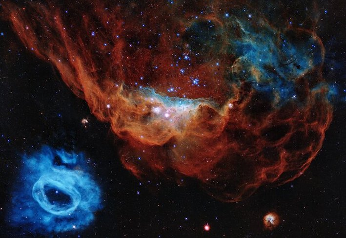
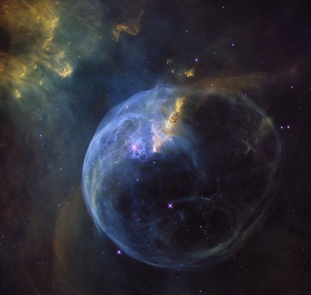

NGC 2020, NGC 2014, NGC 7635

A nebula (plural: nebulae or nebulas) is a vast, diffuse cloud of gas and dust in space. The word "nebula" comes from the Latin word for "mist" or "cloud," which accurately describes their often ethereal and hazy appearance when viewed through telescopes.

Nebulae are fundamental to the life cycle of stars and play various roles in the universe:

Stellar Nurseries (Emission Nebulae): Many nebulae are "stellar nurseries," regions where new stars are born. These are often called emission nebulae because the gas (primarily hydrogen) within them is heated and ionized by the intense ultraviolet radiation from hot, young stars forming within or nearby. This causes the gas to glow, creating beautiful, colorful displays like the Orion Nebula. Gravity pulls clumps of dust and gas together within these cold, dense molecular clouds, eventually leading to the collapse that forms protostars.

Reflection Nebulae: These nebulae don't emit their own light but instead reflect the light from nearby stars. They are typically made of dust that scatters the starlight, giving them a characteristic blue hue, as seen in the Pleiades star cluster.

Dark Nebulae (Absorption Nebulae): These are dense clouds of dust and gas that are so thick they block out the light from stars or other nebulae behind them, appearing as dark, silhouetted patches against a brighter background. The Horsehead Nebula is a famous example. Despite their dark appearance, these are often also sites of future star formation.

Planetary Nebulae: These are not related to planets! They are formed at the end of a low-to-intermediate mass star's life (like our Sun will eventually become). As the star runs out of fuel, it sheds its outer layers into space, forming an expanding shell of glowing ionized gas around the dying stellar core (which becomes a white dwarf). They get their name from their often round, planet-like appearance through early telescopes.

Supernova Remnants: These are the spectacular remains of massive stars that have exploded in a supernova. The explosion blasts stellar material outwards at incredible speeds, creating expanding shells of gas and dust that continue to glow from the energy imparted by the supernova. The Crab Nebula is a well-known example of a supernova remnant.

Nebulae are immense in size, often spanning hundreds of light-years, yet they are incredibly diffuse, meaning the density of matter within them is far less than any vacuum we can create on Earth. They are among the most visually stunning objects in the night sky and offer crucial insights into the processes of star birth, stellar evolution, and the recycling of matter in the cosmos.

This <a href="https://esahubble.org/images/heic2007a/">image</a>, captured by the NASA/ESA Hubble Space Telescope, is a prime example of the turbulent stellar nurseries it has observed throughout its 30-year operational life. It beautifully portrays the magnificent NGC 2014 nebula and its adjacent NGC 2020, which collectively contribute to an expansive star-forming region within the Large Magellanic Cloud – a satellite galaxy of our Milky Way, roughly 163,000 light-years away.

The Bubble Nebula (NGC 7635), an emission nebula located 8,000 light-years from Earth, is showcased in this stunning new <a href="https://esahubble.org/images/heic1608a/">image</a>. The NASA/ESA Hubble Space Telescope observed this view as a celebration of its 26 years in space.