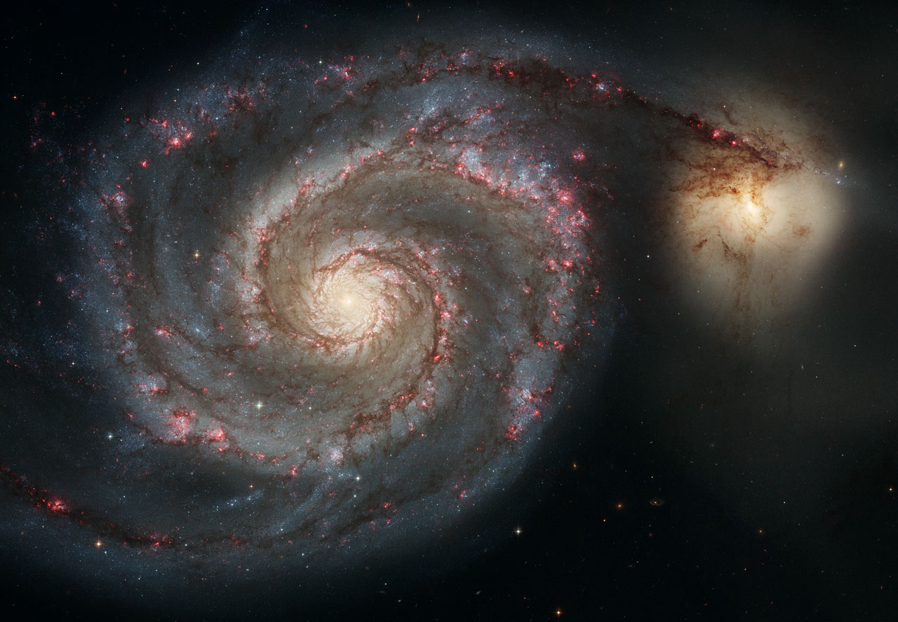

M51 

The majestic spiral galaxy M51 (NGC 5194), famously nicknamed the Whirlpool, is showcased in this exceptionally sharp <a href="https://esahubble.org/images/heic0506b/">image</a> taken by the NASA/ESA Hubble Space Telescope's Advanced Camera for Surveys in January 2005. 

Its graceful, winding arms, appearing like a grand spiral staircase, are actually vast lanes of stars and gas interwoven with dust. This portrait vividly illustrates the galaxy's grand design, from its star-forming outer arms populated by young stars to its yellowish, elder-star-filled central core. 

The Whirlpool's two distinct curving arms are its most striking feature, serving as efficient "star-formation factories." This process begins with dark gas clouds on the inner edge, progressing through bright pink star-forming regions, and culminating in brilliant blue star clusters along the outer edge.

